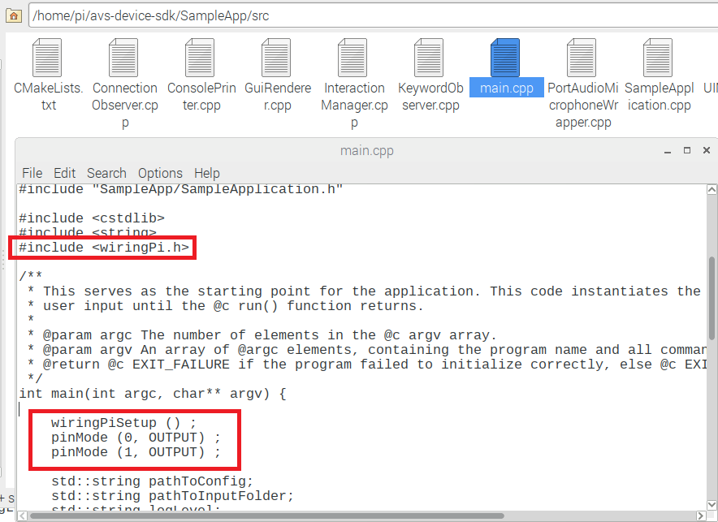

When you build your first Alexa-enabled device, you can follow [AVS's UX Guidelines](https://developer.amazon.com/docs/alexa-voice-service/ux-design-overview.html) to help your customers understand what's happening on the device.  Most Alexa-enabled products use LEDs to let a user know what's happening on the device. We refer to this as the **"Attention State"**.  Some examples of this include a **Blue LED** when Alexa recognizes the Wake Word (listening state), or **Red LEDs** when the user has turned off the microphones (privacy mode).  In this workshop, we’ll use the AVS Device SDK to implement visual indicators of device state into your product.  

The **AVS Device SDK** makes it easy to modify your client's source code.  In this tutorial, we'll hook up some LEDs, add code that implements the **Attention System**, and then rebuild the SampleApp so that it controls the LEDs depending on device state.  Of course, LEDs are just *one* of the things you could do when you start driving output pins on your prototype... if you've got hardware experience, feel free to get creative.


### Get your required hardware

If you've already got some LEDs and resistors laying around, you can use those. For this tutorial, we're using the **GPIO Breakout Bundle** from CanaKit, available from our wishlist [here](http://a.co/46Jz9vy)  


### Hook up your LEDs to the Raspberry Pi

Plug your ribbon cable into the black breakout board and install it in the breadboard as shown in the below picture.  Using two jumper wires, attach them to the pins labeled **17** and **18** on the black breakout PCB. You can do this by plugging into the same row as them on the breadboard.

Install two **resistors** from your kit with color bands **red/red/black/gold** as shown.  This corresponds to **220** ohms which is enough to push some current through the LEDs without exploding them.  Make sure the resistors **straddle** the middle of the breadboard.  

Grab a **Red LED** and a **Blue LED** from your kit. Notice how one of the legs is shorter than the other?  Put the **short leg** in the furthest right row on your breadboard - this should correspond to the **negative terminal** (GND) on the breakout board, marked as negative on both the black PCB and shown as a blue row on the breadboard.  

The long leg of the LED should connect **through a resistor** to your jumper wires - wire **pin 17** to your Red LED's resistor, and **pin 18** to your Blue LED's resistor.


Check your connections against the picture carefully **before** plugging the other end of the ribbon cable into the Raspberry Pi's header.  Ensure your ribbon cable is aligned squarely on the Pi's header without any pins offset or sticking out.


### Modify the AVS Device SDK to implement the Attention System

Now let's write some software to activate the right pins on the Pi.  In File Explorer, navigate to the folder *home/pi/avs-device-sdk/SampleApp/src*

We need to add the **WiringPi** library to the SampleApp project so that we can control output pins on our Raspberry Pi.  Open the file **“main.cpp”** and add the include header statement at the top of the file as shown.

```
#include <wiringPi.h>
```

We will also initialize the library using the function **“wiringPiSetup”**  and set up the GPIOs we plan on using to drive our Red and Blue LEDs.  The Pi makes a couple dozen pins available for use, but for now, let's reserve two output pins for our tutorial. Still in **main.cpp**, scroll down to the `int main` function and add the following code:

```
wiringPiSetup () ;
pinMode (0, OUTPUT) ;
pinMode (1, OUTPUT) ;
```



**Save your text file** and close it.  Still in the *home/pi/avs-device-sdk/SampleApp/src* folder, open the file “UIManager.cpp”.  We need to include the WiringPi.h header file by adding `#include <wiringPi.h>` at the top of your file:


If you've already done the [Indicate Device State with Sounds](/alexa-voice-service/add-sounds.html) tutorial, these next steps will be familiar to you - we're going to find the hooks for **Privacy Mode** and **Listening** state, then add the output commands to them to drive our LEDs.

In your `UIManager::microphoneOff()` function, add `digitalWrite (0, HIGH);` to turn on the Red LED when your microphone is turned off:

Scroll down a bit to the `UIManager::microphoneOn()` function and add `digitalWrite (0, LOW);` to turn the Red LED back off when you exit Privacy Mode.


One more thing!  We need to initialize that LED so it's not in an indeterminate state on startup.  Scroll up to the `UIManager::printWelcomeScreen()` function and add `digitalWrite (0, LOW);` inside the brackets as shown.


Now let's add the Blue LED for Alexa's **Listening** state.  Near the bottom of the file in the `printState()` function, where it says `case DialogUXState::LISTENING:`, add `digitalWrite (1, HIGH);` to drive the Pi's GPIO pin to 3.3V and turn on our LED.

Of course, we've got to switch the LED off when Alexa *isn't* listening. Let's do this by adding a `digitalWrite (1, LOW);` to states `IDLE` and `THINKING`.  When you're finished, your states should include the code as shown below.  Don't forget to save before closing.


Note: This is already done on your **custom OS image** for the tutorial, but if you were doing this on a fresh AVS Device SDK install, you'd need to make a change to the CMake file in order for the project to use the WiringPi library when you rebuild the Sample App.  Open the file “CMakeLists.txt” from the same *home/pi/avs-device-sdk/SampleApp/src* folder and add `target_link_libraries(SampleApp "-lwiringPi")` at the bottom of the file as shown.  


### Rebuild the Sample app

Open a terminal and input the following command to rebuild the Sample App to implement the changes you just made:

```
cd /home/pi/build/SampleApp
sudo make
```

Restart your Sample App by initiating the **startsample.sh** script in a terminal:

```
cd /home/pi/
sudo bash startsample.sh
```

Now, say **"Alexa"** - you should see the Blue LED light up to indicate when your device is in the **"Listening"** state.  Toggle your device in and out of **Privacy Mode** by typing **"m"** and hitting "return" in your Sample App - your Red LED should indicate the state.

You can now use the **AVS Device SDK** to control your own hardware. Feel free to do something creative with your prototype, and stay tuned for more advanced tutorials where we'll follow [AVS's UX Guidelines](https://developer.amazon.com/docs/alexa-voice-service/ux-design-overview.html) to implement animations for `THINKING` and `SPEAKING` states, as well as indicators for **Notifications**, **Error States**, and more.  Be the first to know when new tutorials are released by signing up for our **Voice Mail Newsletter** for professional AVS developers on the [Alexa Voice Service Developer Portal](https://developer.amazon.com/alexa-voice-service).   

If you make something awesome - please share it!  Send a link to laule@amazon.com.

<ul class="pager">
 <li class="previous"><a href="../alexa-voice-service/modify-focus-manager.html">Previous</a></li>

</ul>
