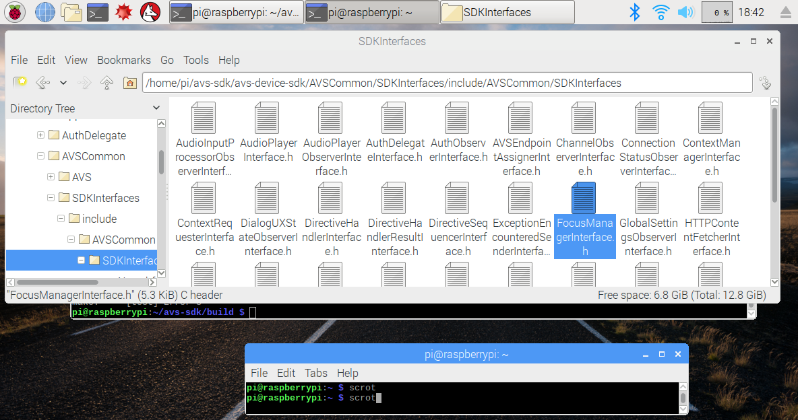

### Modify your Alexa Focus Manager Library behavior

Your device only has one speaker - but at any given time, there might be multiple **Capability Agents** that wish to use it.  The **Focus Manager** exists to ensure a consistent user experience and prevent the chaos of multiple agents speaking over each other at the same time.  But how does it know what to give control of the speaker to?  We've divided different functions (such as **Speech**, **Alarms**, and **Music**) into various **Channels** that take priority over each other in a structure determined by the Focus Manager.  

What if your device's specific use case involved critical functions that you didn't want interrupted?  For example - if you were building an automotive navigation system, your users wouldn't want to miss Alexa's driving directions because an alarm went off and took control of your speaker.  Let's try an example interaction to learn about the behavior of your Sample App's Focus Manager.

{:.steps}
### Initiate two competing Capability Agents

We're going to create a situation that will force the Focus Manager to take control of the **Media Player** according to the existing **Channel Priority** set in your Sample App.

1.  Ask "Alexa, set a timer for 20 seconds".
2.  You should receive a confirmation from Alexa - "*Twenty seconds - starting now*".
3.  Quickly, say "Alexa, sing me a song!"
4.  Within a few seconds, Alexa will start to sing you a pretty great song...  
5.  ... but before the song has a chance to finish - the alarm goes off!  Unfortunately, your song has lost the **Focus** of the device.
6.  Say "Alexa, stop" to get the Alarm to quit beeping.
7.  Once your **Alarms** capability agent has stopped, your song will be allowed to retake the device's **Foreground** channel.

Imagine if that song was actually directions, about to instruct you to exit off the freeway - you might have just missed your turn!  Let's modify our Focus Manager for this specific device to increase the priority of the **Content** channel over the **Alarms** channel.

{:.steps}
### Modify your Focus Manager Interface

1.  In your File Manager, navigate to */home/pi/avs-sdk/avs-device-sdk/AVSCommon/SDKInterfaces/include/AVSCommon/SDKInterfaces*
2.  Right-click on **FocusManagerInterface.h** and select **Text Editor** to open the file.

3.  Scroll down just a bit and you should see the channel priorities listed under FocusManagerInterface.  Lower numbers are higher priority - notice how rather than 1st/2nd/3rd, they're listed as 100/200/300?  This is to allow you the flexibility to create entirely new channels and place them wherever you wish - for example creating a channel number 1-99 would take priority over even **Dialog**.  
4.  For this exercise, we want to bump up the priority of **Content** so that it doesn't get stepped on by **Alerts**.  `CONTENT_CHANNEL_PRIORITY` is currently set to `300` - let's make it a higher priority than Alerts by changing that 300 to `199`.

5.  Save your **FocusManagerInterface.h** file and close it.

{:.steps}
### Rebuild your modified Sample app

1.  You'll need to rebuild the Sample App for the changes to take effect.  First, quit out of your existing instance of the Sample App (if it's still running) by typing "**q**"" and hitting **return**.  Open a terminal and input the following command to rebuild the Sample App:
`cd /home/pi/avs-sdk/build/SampleApp
make
`
2.  You'll see the libraries rebuilding that were modified - it might take a couple of minutes.
3.  When you get the message that your target SampleApp is 100% Built - it's time to re-launch the Sample App and try the same interaction!
4.  Start the Sample App by running this command in the Terminal:
`cd /home/pi/avs-sdk
bash startsample.sh
`
5.  Now, start a 30 second timer again and ask for another song from Alexa.
6.  Despite your timer going off, your song keeps playing!  Congratulations!

Feel free to experiment with other priorities in the Focus Manager to create the best user experience for your product's specific use case.  Keep in mind that when you ship your own Alexa-enabled product, your customers will expect that no matter what else is happening, *every* time they speak to Alexa, she will listen and respond instantly.  

{:.steps}
### Experiment with your Prototype

1.  What do you think will happen if you make something a higher priority than **Dialog**?
2.  Following the instructions from Step 8 of your Lab Manual, run **Unit Test** again.  What was the result?

---
