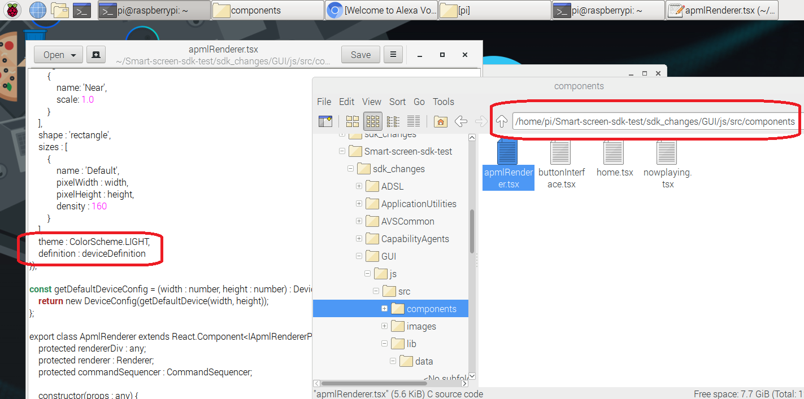

Depending on the size of your screen or how your device is used, you might want to make changes in your screen's display behavior.  Navigate to the following folder in your File Manager: `/home/pi/Smart-screen-sdk-test/sdk_changes/GUI/js/src/components` 

Right click on the file and open it with a text editor.

Scroll down to where you see `Theme:ColorScheme.LIGHT` and change it to `Theme:ColorScheme.DARK` - then save and close.  If you aren't able to save, it may be an ownership issue, you can type the following into the terminal to fix it:

sudo chown -R pi:pi /home/pi

Now, refresh your browser and ask for the weather again!  It should look different - better for low-light environments.

You can also try modifying the shape or screen size and see how the Smart Screen SDK makes it easy to optimize for your unique product capabilities.  

