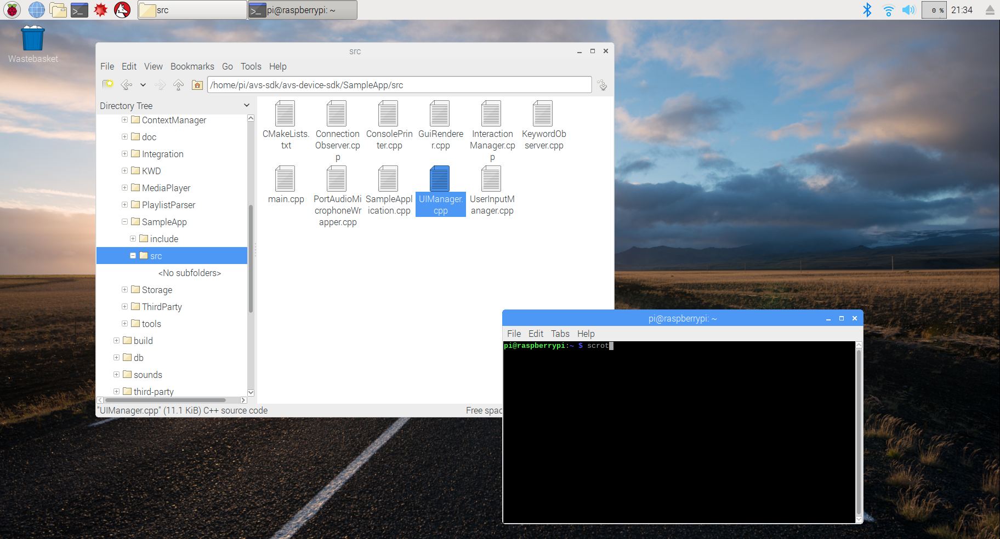

### Modify your UImanager file

If you're speaking to an Alexa-enabled device, you may want an indicator that your wake word was heard.  In some cases, this may be an LED activating or changing color on the device.  But what if you can't see the device?  In this case, you may want your device to play an audio cue to confirm when Alexa hears you.  In this step, you'll modify the **User Interface Manager** to play a **Ding!** each time Alexa's state changes to `LISTENING`.

{:.steps}

1. Navigate to */home/pi/avs-sdk/avs-device-sdk/SampleApp/src/* and open UIManager.cpp with a text editor.

2. At the top of the file where you see the other #include statements, add `#include <cstdlib>`.  This will enable your play function that you'll add in the next step.

3. Your OS image includes a folder at /home/pi/CustomSounds populated with some .wav files to use for this workshop.  You'll need to add a path to one of these sounds to enable your audio cue.  Near the bottom of the file in the `printState()` function, where it says `case DialogUXState::LISTENING:` add the following command:

`system("play /home/pi/CustomSounds/ding.wav")`

4. Save your text file before closing it.
5. You'll need to rebuild the Sample App for the changes to take effect.  First, quit out of your existing instance of the Sample App (if it's still running) by typing "**q** and hitting **return**.  Open a terminal and input the following command to rebuild the Sample App:
`cd /home/pi/avs-sdk/build/SampleApp
make
`
6. Restart your Sample App by initiating the **startsample.sh** script in a terminal:
`cd /home/pi/avs-sdk
bash startsample.sh
`

{:.verify}
### Checkpoint 11

Every time you speak the wake word "Alexa" to your prototype (Alexa's state changes to "Listening...") you should hear your custom sound play, indicating that Alexa has opened a channel to the cloud and is ready for your request.  The */home/pi/CustomSounds* folder has several different .wav files - experiment with different sounds at various states in the UI manager!

Your customers will expect their experience to be consistent across many Alexa-enabled devices.  You can learn best practices for implementing visual and audio cues on your device by visiting our [AVS UX Design overview page](https://developer.amazon.com/docs/alexa-voice-service/ux-design-overview.html).

---
