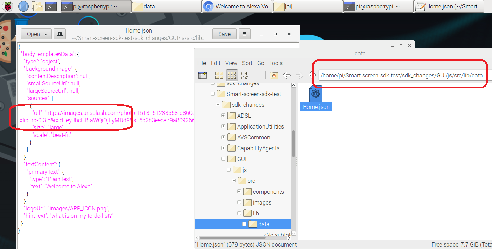

### Modify your home screen

When you ship your screen-based product with Alexa built-in, you'll probably want your own home screen to display when the device isn't in use.  For example, if you were building Alexa into your smart thermostat, you could display a control screen that showed your own data when the customer wasn't asking Alexa a question.  The Alexa for Smart Screen and TV SDK makes it easy to customize your device behavior.

In your File Manager, navigate to `/home/pi/Smart-screen-sdk-test/sdk_changes/GUI/js/src/lib/data`  Right click on the **Home.json** file and select open with Text Editor to modify the file as shown in the below picture. 



Here, you can input any URL to replace your home screen with.  Make your own, or try the following:

```
FLETCH INPUT UPDATED PIC LINK HERE
```

Save and close the file.  If you aren't able to save, it may be an ownership issue, you can type the following into the terminal to fix it:
```
sudo chown -R pi:pi /home/pi
```

When you're ready, you don't need to re-compile or restart the sample app, just refresh your browser in Chromium.  You should see your own custom home screen image when you aren't interacting with Alexa!

Feel free to poke around in the Home.json file and see what other changes you can make to improve the customer experience on your device.
