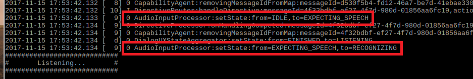

{:.steps}
### Interact with Your Prototype

You can now talk to your Pi by simply saying the wake word "Alexa". Try the following, and watch the output in the terminal window to see the directives and events that flow for each -

* Say "Alexa", then ask "What time is it?"  
* Say "Alexa", then ask "What's the weather in Las Vegas?"  
* Say "Alexa", then say "Set a timer for 5 seconds."
* Say "Alexa", then say "Play NPR news on TuneIn."
* Say "Alexa", then say "Good afternoon."
* Say "Alexa", then say "Tell me a joke."
* Say "Alexa", then ask "What's the meaning of life?"
* Say "Alexa", then say "Sing happy birthday."
* Say "Alexa", then ask "What day of the week does Christmas fall on?"
* Say "Alexa", then ask "Where were you born?"
* Say "Alexa", then ask "Can you rap?"

### Try a Multi-Turn interaction

* Say "Alexa", then ask "Set an alarm for 12:30".  You should receive a response asking you to clarify AM or PM.  Respond to the question with "Afternoon".  If you have DEBUG9 active, scroll up until you see **Listening...** - right above that you'll see that the state of the **Audio Input Processor** (AIP) has changed from `IDLE` to `EXPECTING_SPEECH` and then `RECOGNIZING` - without you speaking the wake word!  Typically, the AIP is triggered by the **Wake Word Engine** running on the client - but in this case, it's been activated via a **Directive** delivered down to your client from the cloud.

Multi-turn interactions can feel like a more natural method of communication, since you can continue to speak with Alexa as part of a continuing conversation without starting every phrase with "Alexa".  

### Other interactions to Try

* Say "Alexa, Wikipedia" - you'll have the option of looking up any subject without having to speak the wake word before the subject.
* Say "Alexa, let's chat" to initiate a conversation with a chat bot!
* Say "Alexa, play Yes Sire" to play a medieval-themed game using your voicee.
