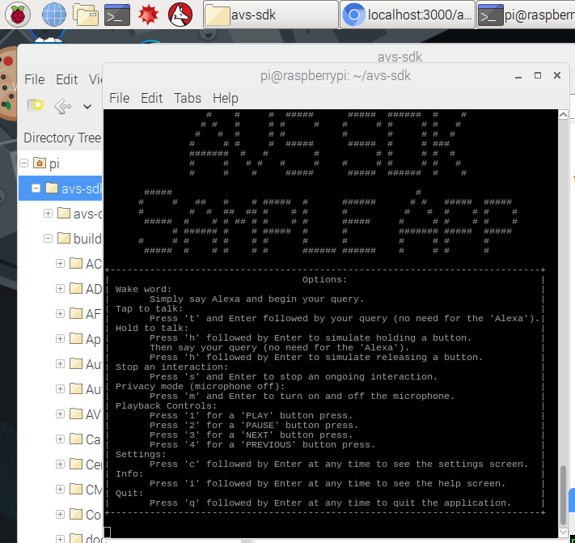
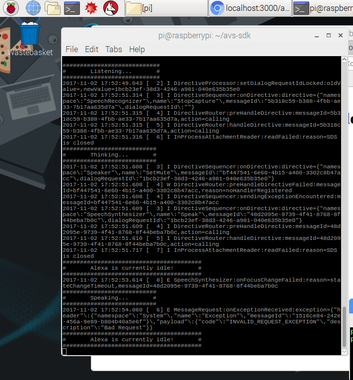

The sample application is in the folder */home/pi/avs-sdk/build/SampleApp/src*. In order to start it, we'll use a shell script called **startsample.sh**. To see how your script starts the Sample App, you can use File Manager to navigate to */home/pi/avs-sdk* and use your text editor to view the contents:

You can see that it is starting with the highest debug level, **DEBUG9**.  This will display status messages in the console as you communicate with Alexa.  If you want to reduce output, simply change that to a lower number or remove it altogether. For starters, try it at the highest level so you can see what is going on behind the scenes.

## Terminal Window
{:.steps}
From a terminal window, navigate to your *avs-sdk* folder and run **startsample.sh** to launch the Sample App.

`cd /home/pi/avs-sdk
bash startsample.sh`

You should see the following screen indicating that the Sample App is ready for interaction:

{:.verify}
### Checkpoint 9

Say "Alexa" into the microphone on your Raspberry Pi to trigger the **Wake Word Engine**.  Since you are using a single microphone in a noisy environment, you may want to speak closely into your microphone to ensure your voice is heard clearly.  You should see the console status change to **Listening**, indicating the wake word was recognized.  Then say "tell me a joke." If Alexa responds with **Thinking...**, then **Speaking**, congratulations!  You have a working prototype.  

As you interact with your prototype, you should see a series of status changes annotated by your level of DEBUG set (DEBUG9 in this picture).  If you cannot hear Alexa's response, ensure your speaker/earbuds are turned on and plugged in to your Raspberry Pi's 3.5mm audio jack.  Check that your audio output on your Pi is set to **Analog** by right-clicking on the speaker icon in the top right corner of the screen.

If Alexa isn't responding or your Sample App appears stuck at a certain step (displaying error messages when you try to speak), just type "**s**" and hit return to stop that interaction.  You can also type "**q**" and hit return to exit from the Sample App.
