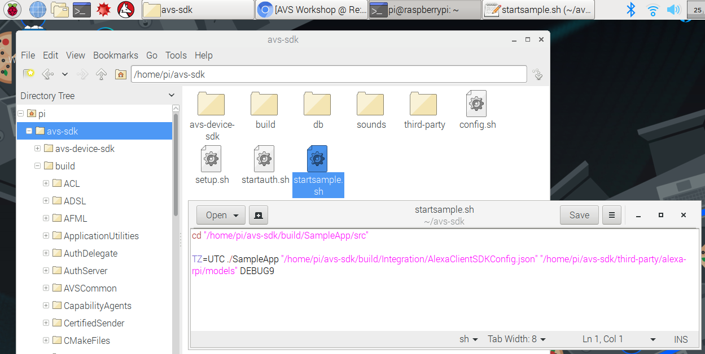

The sample application is in the folder */home/pi/avs-sdk/build/SampleApp/src*. In order to start it, we'll use a shell script called **startsample.sh**. To see how it is being started, you can use File Manager to navigate to */home/pi/avs-sdk* and use your text editor to view the contents:

You can see that it is starting with the highest debug level, **DEBUG9**.  This will display status messages in the console as you communicate with Alexa.  If you want to reduce output, simply change that to a lower number or remove it altogether. For starters, try it at the highest level so you can see what is going on behind the scenes.

## Terminal Window
{:.steps}
From a terminal window, run **startsample.sh** to launch the Sample App.

`cd /home/pi/avs-sdk
bash startsample.sh`

You should see the following screen indicating that the Sample App is ready for interaction:

{:.verify}
### Checkpoint 9

Say "Alexa" into the mic on your Raspberry Pi. You should see the console status change to **Listening**, then say "tell me a joke." If Alexa responds with **Thinking...**, you have a working prototype.  
You should see a series of status changes annotated by your level of DEBUG set (DEBUG9 in this picture).  
If you cannot hear Alexa's response, ensure your speaker/earbuds are turned on and plugged in to your Raspberry Pi's 3.5mm audio jack.
If Alexa isn't responding and appears stuck at a certain step, just type "**s**" and hit return to stop that interaction.

