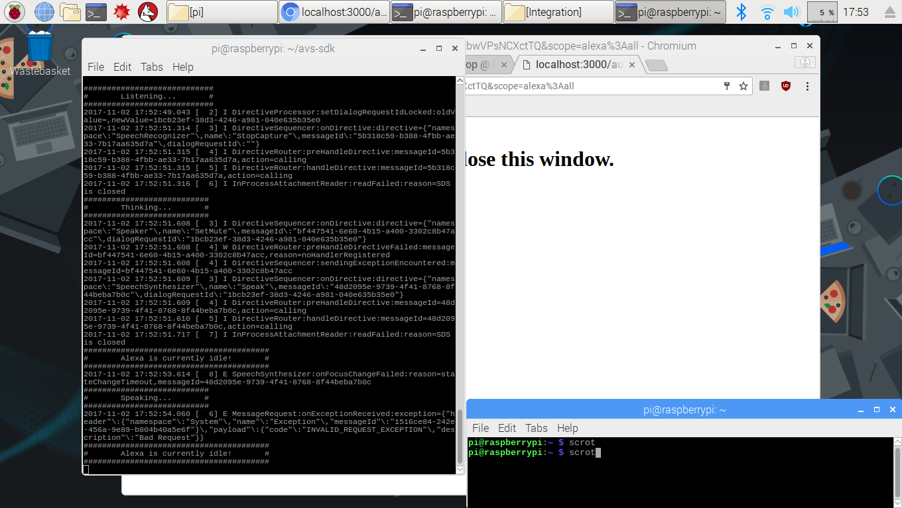
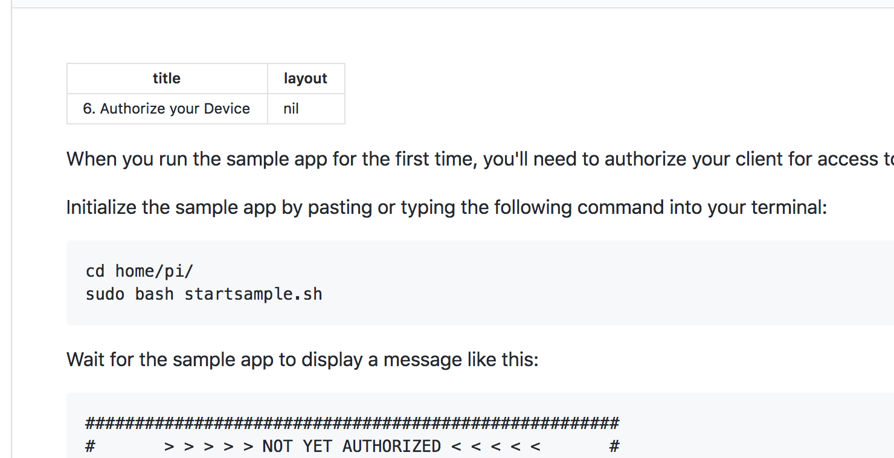

When you run the sample app for the first time, you'll need to authorize your client for access to AVS.

Initialize the sample app by pasting or typing the following command into your terminal:


```
cd home/pi/
sudo bash startsample.sh
```

Wait for the sample app to display a message like this:
```
######################################################
#       > > > > > NOT YET AUTHORIZED < < < < <       #
######################################################

############################################################################################
#     To authorize, browse to: 'https://amazon.com/us/code' and enter the code: {XXXX}     #
############################################################################################
```
 Use a browser to navigate to the URL specified in the message from the sample app.
    Authenticate using your Amazon user credentials.
    Enter the code specified in the message from sample app.
    Select “Allow”.
Wait (it may take as long as 30 seconds) for CBLAuthDelegate to successfully get an access and refresh token from Login With Amazon (LWA). This may take At this point the sample app will print a message like this:
```
########################################
#       Alexa is currently idle!       #
########################################
```
You are now ready to use the sample app. The next time you start the sample app, you will not need to go through the authorization process.

{:.verify}
### Checkpoint 9

Say "Alexa" into the microphone on your Raspberry Pi to trigger the **Wake Word Engine**.  Since you are using a single microphone in a noisy environment, you may want to speak closely into your microphone to ensure your voice is heard clearly.  You should see the console status change to **Listening**, indicating the wake word was recognized.  Then say "tell me a joke." If Alexa responds with **Thinking...**, then **Speaking**, congratulations!  You have a working prototype.  




As you interact with your prototype, you should see a series of status changes annotated by your level of DEBUG set (DEBUG9 in this picture).  If you cannot hear Alexa's response, ensure your speaker/earbuds are turned on and plugged in to your Raspberry Pi's 3.5mm audio jack.  Check that your audio output on your Pi is set to **Analog** by right-clicking on the speaker icon in the top right corner of the screen.

If Alexa isn't responding or your Sample App appears stuck at a certain step (displaying error messages when you try to speak), just type "**s**" and hit return to stop that interaction.  You can also type "**q**" and hit return to exit from the Sample App.


