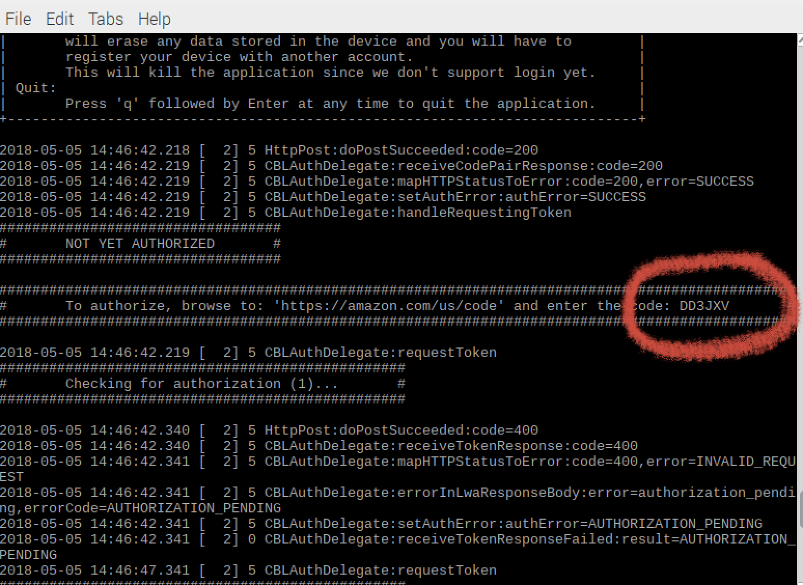
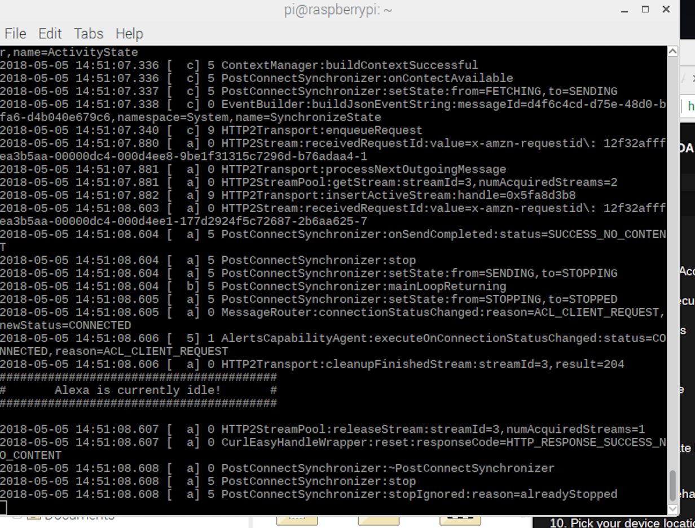

When you run the sample app for the first time, you'll need to authorize your client for access to AVS.

Initialize the sample app by pasting or typing the following command into your terminal:


```
cd /home/pi/
sudo bash startsample.sh
```

Wait for the sample app to display a message like this:



 1. Use a browser to navigate to [amazon.com/us/code](https://amazon.com/us/code)   
 2. Authenticate using your Amazon user credentials.  If you aren't able to log in - try deleting all cookies or open a new tab in incognito mode browser, then go to [amazon.com/us/code](https://amazon.com/us/code)
 3. Enter the code specified in the message from sample app.  
 4. Select “Allow”.  
 5. Wait (it may take as long as 30 seconds) for CBLAuthDelegate to successfully get an access and refresh token from Login With Amazon (LWA).  
 6. At this point the sample app will print a message like this:
```
########################################
#       Alexa is currently idle!       #
########################################
```


You are now ready to use the sample app. The next time you start the sample app, you will not need to go through the authorization process.

Now, you'll need to open a browser to add visual elements to your prototype.  Open a new chromium tab to the following URL: 
`file:///home/pi/avs-device-sdk/GUI/js/dist/index.html?insecure=1`  

Note, this should autocomplete in your browser when you start typing - it's also in the bookmarks as "Alexa Home Screen".

Congrats on your progress so far!  Now it's time to talk with Alexa.


