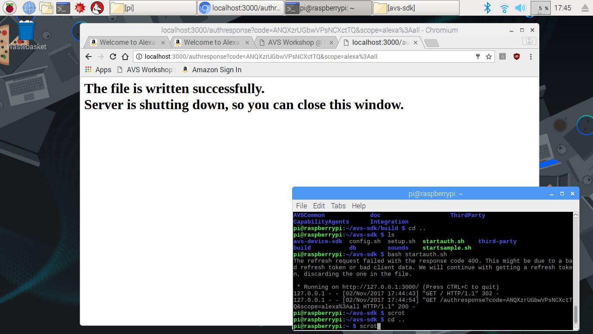

The install process created a few shell scripts for you - **startauth.sh** to get you the authorization token, and **startsample.sh** to run the Sample App.
Your device has the SDK installed and your credentials loaded, but your device still needs a **refresh token** in order to enable your client to maintain a connection to the AVS in the cloud.  If you design an Alexa-enabled device, and ship a million of them to your customers, they could all use the same Client ID, Client Secret, and ProductID - but each *individual* device will require a unique refresh token to authenticate with the AVS through Login With Amazon (LWA).

## Terminal Window
{:.steps}

Copy and paste the following command into a terminal window to navigate to the *avs-sdk* directory and run the **startauth.sh** script:

`cd /home/pi/avs-sdk
bash startauth.sh`

In your Web Browser, go to [http://localhost:3000](http://localhost:3000).  
You'll be prompted to log into Amazon to generate the refresh token.
Your browser page should show that it succeeded, and the auth server will automatically terminate.  Close the browser window to continue.

{:.verify}
### Checkpoint 8

1. From the File Manager, navigate to */home/pi/avs-sdk/build/Integration* and open **AlexaClientSDKConfig.json** by right-clicking on it and selecting **Text Editor**.
2. Verify that you have populated fields for everything in the **authDelegate** section, including **refreshToken** (it should be a very long string of characters).
