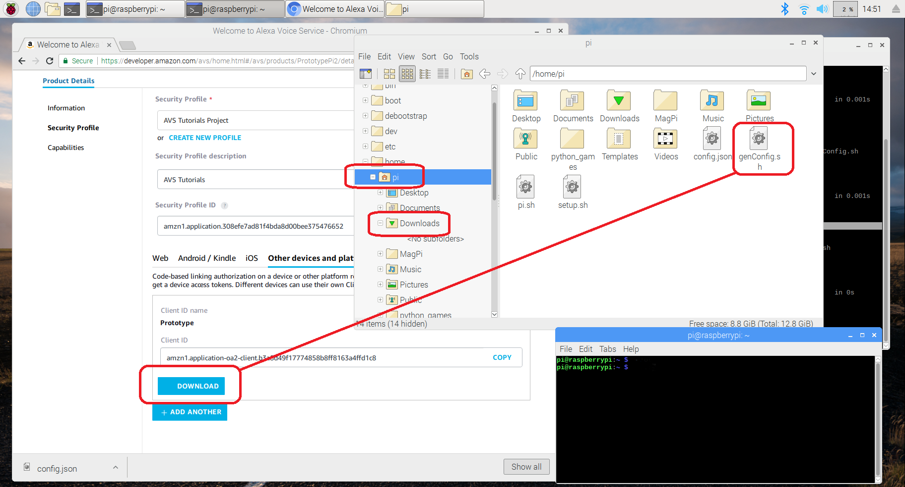
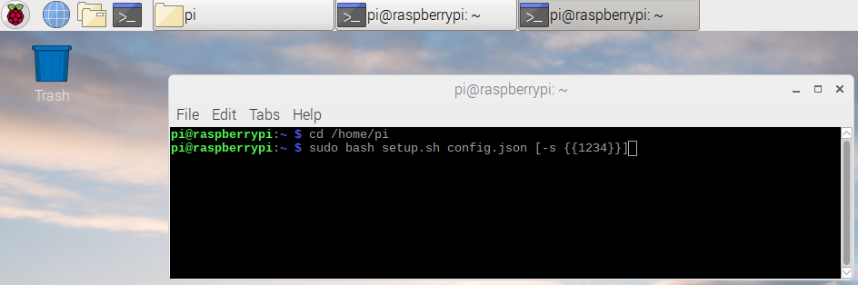

### Download your credentials

If you didn't already save it to your Pi when creating your product profile, it's time to get your **config.json** file onto your client device.  Start by opening a browser and logging into your [AVS dashboard](https://developer.amazon.com/avs/home.html#/avs/home). Click on your Product Name, it should be **AVS Tutorials Project** or whatever you named it when creating the product profile.

This will take you to a product menu - on the left side you should see Product Details.  Select Security Profile below that and choose **Other devices and platforms** from the *Web - Android/Kindle - iOS - Other devices and platforms* menu.

When you click the **Download** button on your Security Profile in your web browser, you'll see a **config.json** file appear in your home/pi/downloads folder.  In the file manager, copy this file from the /downloads folder and place it in your home/pi folder as shown in the picture below.

downloadConfig_large.png

Now that your Raspberry Pi has your own **unique credentials** loaded on it, it's time to build your SDK.
